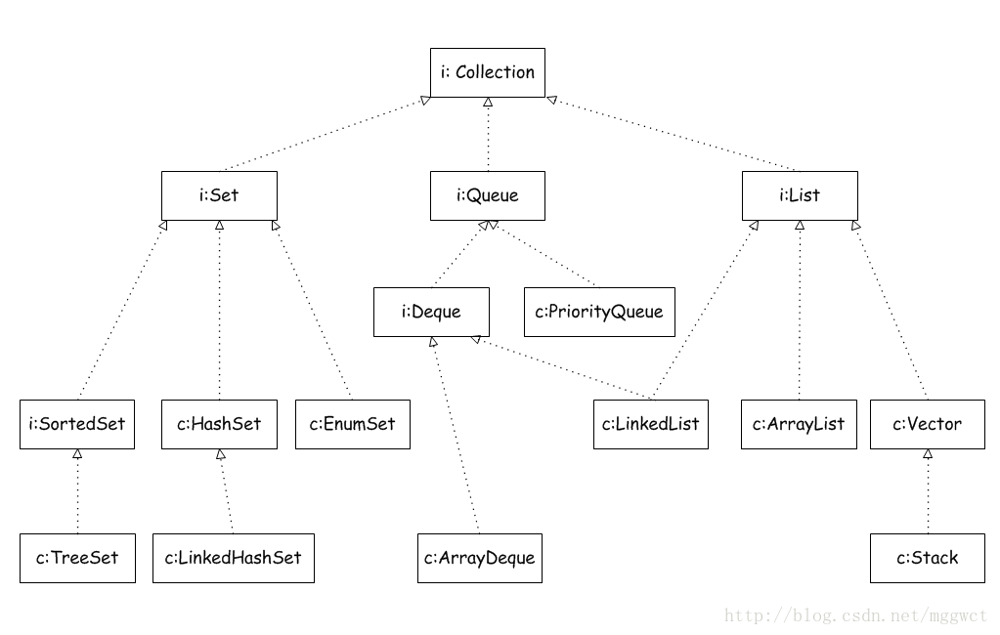
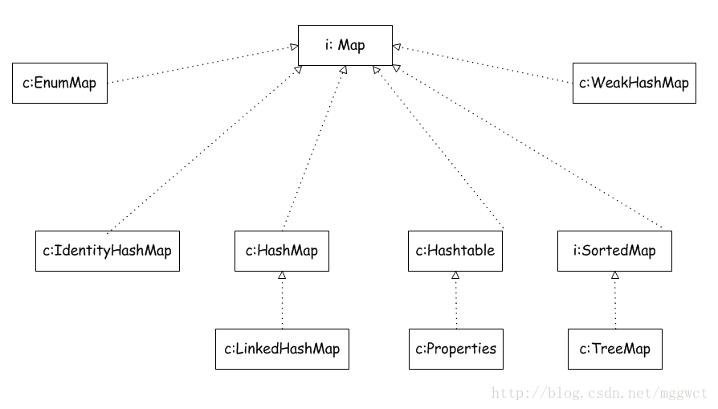

# java常见基础问题总结
## 基本概念
### 为什么需要public static void main(String[] args)
> public static void main(String[] args)是java程序的入口方法，JVM在运行程序时，会先查找main()方法，public 是权限修饰符， static 表明main() 是个静态方法，不需要实例化对象也能执行。

> 通常来讲，要执行一个类的方法，必须实例化一个类的对象，然后通过对象调用方法
，main是设计成程序的入口方法，所以当程序运行时，应该不需要实例化类就可以调用该方法，所以main()方法被定义成 public 和 static

> public与static没有先后顺序，也可以把main方法定义成final, 也可以用synchronized来修饰main()方法，

> 不能用abstract来修饰main()方法， 因为abstract修饰方法，是为了子类覆盖该方法，是在程序运行时被确定的(动态)，而static方法则是在编译时就已经确定，属于静态，两者不能共存

### 如何实现在main方法执行前输出
> 静态块在类被加载时就会被调用，因此可以在main()方法执行之前调用
public class Test{
    public void main(String[] args){
        System.out.println("Hello World2");
    }
    static{
        System.out.println("Hello World1")
    }
}
> 注意静态块不管顺序如何，都会在main()方法执行之前执行，这和Java程序的初始化顺序有关
### java程序初始化的顺序
> Java程序初始化顺序一般遵循3个原则(优先级递减)
1. 优先级1 ：static 属性 / 静态块 > 方法
2. 优先级2:：非静态属性/静态块加载
3. 优先级3 ：非静态方法加载
同类按照代码顺序即可
注意：继承情况下父类优先加载
> 静态内部类在使用的是时候再加载

### java的集合框架
> java的util包下，集合类时我们在开发中用的最多的工具类
> 整个集合体系起源可以分为两个接口：Iterator和Map，其他都是基于这两个接口实现的
> Iterator的子接口是Collection, Iterator的方法很少，只有三个：iterator(); forEach(Consumer action),spliterator();
> 整个集合框架的体系可以看成两个节点出发：Collection 和 Map
> Collection结构图如下：

> Map的结构图如下

### java 抽象类和接口的区别和联系
#### 共同点
1. 都是上层的抽象层
2. 都不能被实例化
3. 都能包括抽象的方法，这些抽象的方法用于描述其具备的功能，不提供具体的实现方法
#### 区别
1. 抽象类中可以写非抽象的方法，避免子类中重复书写，提高代码的复用性
    接口中只有抽象的方法
2. 类只能继承于一个类(普通类和抽象类)，但是类能实现多个接口
