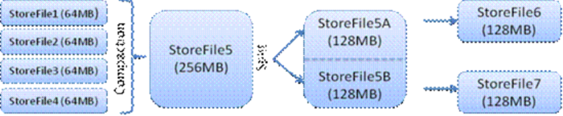

# Hbase框架
> 学习一种框架，需要了解
1. 架构组成？
2. 每部分实现了什么功能？
3. 遇到什么问题？怎么解决的？
4. 适用于什么场景
> Hbase是No-sql(非关系型数据库)的一种，常见的No-sql还有mongoDB
## 架构组成
> Hbase采用Master/Slave架构搭建集群，隶属于Hadoop生态系统，架构上由HMaster节点，HRegionServer节点，ZooKeeper集群组成
### Client
> 主要实现功能
1. 整个HBase集群的访问入口
2. 使用HBase RPC机制与HMaster和HRegionServer进行通信
    > 与HMaster进行通信进行管理表
    > 与HRegionServer进行数据读写
3. 访问HBase的接口，并维护cache(缓存机制，一般数据库都存在这种机制)加快访问Hbase速度
### ZooKeeper
> 主要实现功能
1. 存储所有HRegion的寻址入口(meta表的Region地址)
2. 保证任何时候，集群只有一个HMaster,管理HMaster的failover(宕机)  // 监控HMaster
3. 实时监控HRegionServer的上线下线信息，并通知给HMaster // 监控HRegionServer
4. 存储Hbase中的schema和表的元数据
5. Zookeeper Quorum存储表地址、HMaster地址。

> 另外，HMaster通过监听ZooKeeper中的Ephemeral节点(默认：/hbase/rs/*)来监控HRegionServer的加入和宕机。在第一个HMaster连接到ZooKeeper时会创建Ephemeral节点(默认：/hbasae/master)来表示Active的HMaster，其后加进来的HMaster则监听该Ephemeral节点，如果当前Active的HMaster宕机，则该节点消失，因而其他HMaster得到通知，而将自身转换成Active的HMaster，在变为Active的HMaster之前，它会创建在/hbase/back-masters/下创建自己的Ephemeral节点 

### HMaster
> 主要实现以下功能
1. HMaster没有单点问题，Hbase可以启动多个HMaster，通过ZooKeeper的Selection机制来保证只有一个HMaster正在运行
2. 管理用户对表的创建，删除等操作(管理表)
3. 管理HRegionServer的负载均衡，调整Region分布
4. Region Split后，负责新Region的分布
5. 在HRegionServer停机后，负责失效HRegionServer上Region迁移工作

### HRegionServer
> 主要实现以下功能：
1. 处理HRegion的IO请求，向HDFS文件系统中读写数据
2. 切分在运行过程中变得过大的HRegion
3. Client访问hbase上数据的过程并不需要HMaster的参与(寻址访问ZooKeeper和HRegionServer，读写访问HRegionServer)

#### HRegion
> HRegion是直接负责数据模块的
> Hbase使用RowKey将表水平切割成多个HRegion, 从HMaster的角度，每个HRegion都会记录StartKey和EndKey()
> RowKey是经过排序的，client可以通过HMaster快速定位每个Rowkey在哪个HRegion中。
> HRegion由HMaster分配给一个HRegionServer,然后由HRegionServer负责HRegion的启动和管理，和Client的通信，HDFS的读写等
> 注意HRegion中的存储也是按照列族的方式进行存储(不同列族之间的数据都是物理隔离的，处于不同的region中间)

## 读写过程
### 写数据
1. Zookeeper中存储了meta表的region信息，从meta表获取相应的region信息，然后找到meta表的数据
2. 根据namespace,表名，rowkey查找meta表中写入数据对应的Region信息
3. 找到HRegion对应的HRegionserver
4. 把数据分别写到HLog和MemStore(内存空间)上各一份
5. MemStore达到一个阈值后则把数据刷成一个StoreFile文件。如果MemStore上数据有丢失，可以利用HLog恢复
6. 当多个storeFile文件达到一定大小后，会触发Compact操作合并操作，合并成一个大的StoreFile
7. 当逐步形成越来越大的StoreFIle后，会触发Split操作，把当前的StoreFile分成两个，相当于把大的Region切分成两个Region
如下图：

### 读数据
1. Zookeeper中存储了meta表的region信息，从meta表获取相应的region信息，然后找到meta表的数据
2. 根据namespace、表名和rowkey在meta表中找到对应的region信息
3. 找到这个region对应的regionserver, 根据region信息查找对应的region
4. 先从MemStore找数据，如果没有，再到StoreFile上读(为了读取的效率)。
