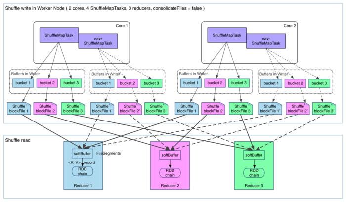
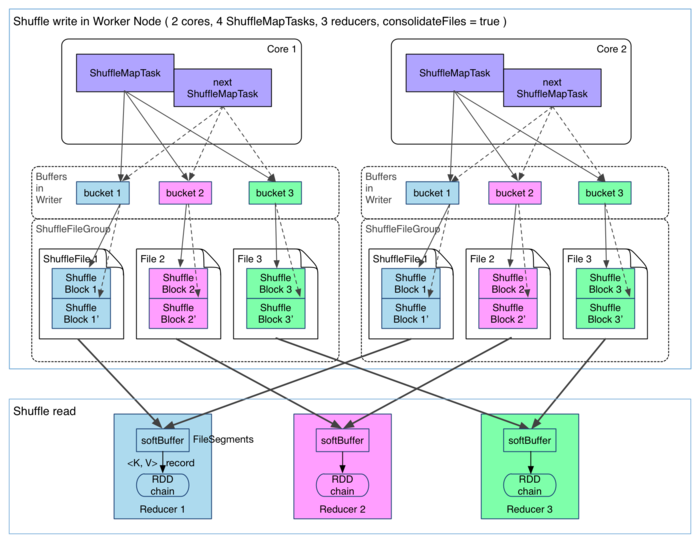
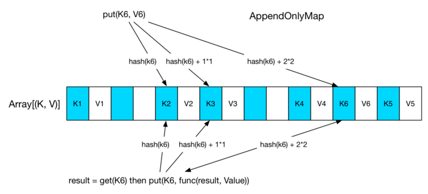

# Shuffle过程
## 为什么需要Shuffle
> Shuffle其实是个重新洗牌的意思，但在MR框架中更像是将杂乱的数据清洗成有规则的数据
## Hadoop MR VS Spark
> Hadoop 和 Spark都会有shuffle过程，其过程大同小异
### 相似点
> 都是将mapper(Spark里为ShuffleMap Task)的输出进行partition, 不同的partition发送给不同的reducer(Spark里面的reducer可能是下一个stage中的ShuffleMapTask，也可能是ResultTask)

### 差异
> Hadoop MR是Sort-based, 进入combine和reduce的records必须先sort,这样做的好处是可以处理大规模的数据，因为其输入数据可以通过外排序的方式得到排序(mapper先对每段数据做排序，然后reducer只需要只要对排序好的数据进行归并即可)
> Spark1.2.0 Shuffle之前使用的是Hash-based，1.2.0之后使用Sort-based,Hash-Based不需要排序

## Spark Shuffle
> Spark进行shuffle的时候分为两步，Shuffle Write 和 Shuffle Read
> 将Map端划分数据，持久化数据的过程称为Shuffle write, 将reducer端读入数据(fetch),aggregate数据的过程称为shuffle read
> 下面重点讲一讲shuffle read/write
### Shuffle write
> 由于不要求数据有序，shuffle write的任务很简单：
1. 将数据进行分区，按照Partitioner进行分区，默认的分区函数是hash函数
2. 数据做持久化，为什么做持久化：(1) 减少内存压力 (2) 可以实现容错
shuffle write 的任务很简单，那么实现也很简单：将 shuffle write 的处理逻辑加入到 ShuffleMapStage（ShuffleMapTask 所在的 stage） 的最后，该 stage 的 final RDD 每输出一个 record 就将其 partition 并持久化。图示如下：

> ShuffleMapTask 的执行过程很简单：先利用 pipeline 计算得到 finalRDD 中对应 partition 的 records。每得到一个 record 就将其送到对应的bucket(缓冲区)里，具体是哪个bucket由partitioner.partition(record.getKey()))决定。每个 bucket 里面的数据会不断被写到本地磁盘上，形成一个ShuffleBlockFile，或者简称FileSegment。之后的 reducer 会去 fetch 属于自己的 FileSegment，进入 shuffle read 阶段。

> 这样的实现很简单，存在两个问题：
1. 产生的FileSegment过多，按照上图中的设计，假设Reducer数目为R, ShuffleMapTask数目为M，那么总共会产生M*R个FileSegment
    spark job的M, R都很大，磁盘上会存在大量的文件
2. 缓冲区占用内存空间大。每个ShuffleMapTask会产生R个Bucket，那么M个task就会产生M*R个Bucket,考虑到Bucket可以回收，同时在线的Bucket应该由并发数Core决定，故总量应该是Core*R个Bucket

> 目前，第二个问题没有较好的解决方法，但是第一个问题已经解决，Spark现在存在FileConsolidation方法。先上图：

> 实际上，就是改变每个task生成R个文件的模式，改用每个core生成R个文件模式。具体实现上，先执行完的可以生成shuffleBlocki, 后执行的将文件写到shuffleBlocki的后面，每个ShuffleBlock称为FileSegment，那么每个worker上存在的文件数降为core*R
> 通过spark.shuffle.consolidateFiles=true来开启

### Shuffle Read
> Shuffle Read实际上是下一个Stage将属于该分区的数据fetch过来
#### 什么时候fetch
> 当parent stage中所有task完成后再fetch。(不同于Hadoop MR过程，其可以边运行边fetch)

> 原则上，一个ShuffleMapTask结束后就可以fetch。但是为了Stage的完整性，所以是上一stage结束了然后进行fetch。
> 因为 fetch 来的 FileSegments 要先在内存做缓冲，所以一次 fetch 的 FileSegments 总大小不能太大。Spark 规定这个缓冲界限不能超过 spark.reducer.maxMbInFlight，这里用 softBuffer 表示，默认大小为 48MB。一个 softBuffer 里面一般包含多个 FileSegment，但如果某个 FileSegment 特别大的话，这一个就可以填满甚至超过 softBuffer 的界限

#### 边fetch边处理么？
> 边fetch边处理(和hadoop的边copy边sort是一致的)

> MapReduce 为了让进入 reduce() 的 records 有序，必须等到全部数据都 shuffle-sort 后再开始 reduce()。
> Spark不需要满足shuffle之后的数据有序，因此不需要shuffle完成后再进行reduce计算。一般采用aggregate的数据结构，比如说HashMap。每次从缓冲的FileSegment中 deserialize(反序列化)出来一个<Key, Value>的数据，就直接放入HashMap, 如果key存在，那么可以直接执行aggregate函数，func(hashMap.get(key), value), 如word count程序中就是hashMap.get(key) + value,然后将结果重新put到hashMap中，这一步就是reduce函数的功能，和Hadoop的MR的区别如下，从计算方式上来看，Hadoop的MR的灵活性更高

>
// MapReduce
reduce(K key, Iterable<V> values) { 
    result = process(key, values)
    return result   
}

// Spark
reduce(K key, Iterable<V> values) {
    result = null 
    for (V value : values) 
        result  = func(result, value)
    return result
}

> 如此一来，MR求均值就非常方便，而Spark中的value就得map成(v, 1)的格式, 前者用于计算sum，后者用于计算count
> 最后map计算 sum / count即可得到平均值

#### fetch来的数据存在位置
> 刚fetch来的数据存放在softBuffer缓冲区，经过处理后的数据放在内存+磁盘。可以设置处理后的数据放在内存还是磁盘上
> 如果spark.shuffle.spill = false就只用内存。内存使用的是AppendOnlyMap ，类似 Java 的HashMap，内存＋磁盘使用的是ExternalAppendOnlyMap，如果内存空间不足时，ExternalAppendOnlyMap可以将 <K, V> records 进行 sort 后 spill 到磁盘上。
> 在Spark中，和Hadoop采用同样的策略，一旦ExternalAppendOnlyMap达到一个阈值就开始spill
#### 怎么获取fetch的数据的存放位置
> 在上一章讨论物理执行图中的 stage 划分的时候，我们强调 "一个 ShuffleMapStage 形成后，会将该 stage 最后一个 final RDD 注册到 MapOutputTrackerMaster.registerShuffle(shuffleId, rdd.partitions.size)，这一步很重要，因为 shuffle 过程需要 MapOutputTrackerMaster 来指示 ShuffleMapTask 输出数据的位置”。因此，reducer 在 shuffle 的时候是要去 driver 里面的 MapOutputTrackerMaster 询问 ShuffleMapTask 输出的数据位置的。每个ShuffleMapTask完成时会将FileSegment的存储位置信息汇报给MapOutputTrackerMaster。

#### Shuffle read中的HashMap
1. AppendOnlyMap
> A simple open hash table optimized for the append-only use case, where keys are never removed, but the value for each key may be changed
> 类似于HashMap,但是只增不减(没有remove函数)，具体见下图

> 原理很简单，开启一个巨大的Object数组，蓝色存储key值，右边白色存储value值
> Java中的hashMap采用链式原则，但是此处是采用探测方法来解决key冲突问题
> 迭代 AppendOnlyMap 中的元素的时候，从前到后扫描输出。
> 如果 Array 的利用率达到 70%，那么就扩张一倍，并对所有 key 进行 rehash 后，重新排列每个 key 的位置。
> AppendOnlyMap 还有一个 destructiveSortedIterator(): Iterator[(K, V)] 方法，可以返回 Array 中排序后的 (K, V) pairs。实现方法很简单：先将所有 (K, V) pairs compact 到 Array 的前端，并使得每个 (K, V) 占一个位置（原来占两个），之后直接调用 Arrays.sort() 排序，不过这样做会破坏数组（key的位置变化了）

2. ExternalAppendOnlyMap

> ExternalAppendOnlyMap 持有一个 AppendOnlyMap，shuffle 来的一个个 (K, V) record 先 insert 到 AppendOnlyMap 中，insert 过程与原始的 AppendOnlyMap 一模一样。如果 AppendOnlyMap 快被装满时检查一下内存剩余空间是否可以够扩展，够就直接在内存中扩展，不够就 sort 一下 AppendOnlyMap，将其内部所有 records 都 spill 到磁盘上。图中 spill 了 4 次，每次 spill 完在磁盘上生成一个 spilledMap 文件，然后重新 new 出来一个 AppendOnlyMap。最后一个 (K, V) record insert 到 AppendOnlyMap 后，表示所有 shuffle 来的 records 都被放到了 ExternalAppendOnlyMap 中，但不表示 records 已经被处理完，因为每次 insert 的时候，新来的 record 只与 AppendOnlyMap 中的 records 进行 aggregate，并不是与所有的 records 进行 aggregate（一些 records 已经被 spill 到磁盘上了）。因此当需要 aggregate 的最终结果时，需要对 AppendOnlyMap 和所有的 spilledMaps 进行全局 merge-aggregate

#### merge-aggregate
> merge-aggregate包括AppendOnlyMap和mergeHeap和mergeBuffer三部分。
> 其中mergeHeap是最小堆的数据结构

> 先将 AppendOnlyMap 中的 records 进行 sort，形成 sortedMap。然后利用 DestructiveSortedIterator 和 DiskMapIterator 分别从 sortedMap 和各个 spilledMap 读出一部分数据（StreamBuffer）放到 mergeHeap 里面。
> StreamBuffer 里面包含的 records 需要具有相同的 hash(key)，所以图中第一个 spilledMap 只读出前三个 records 进入 StreamBuffer。
> 将mergeHeap中的StringBuffer一个个放入 mergeBuffers 中，放入的时候与已经存在于 mergeBuffers 中的 StreamBuffer 进行 merge-combine，第一个被放入 mergeBuffers 的 StreamBuffer 被称为 minBuffer，那么 minKey 就是 minBuffer 中第一个 record 的 key。当 merge-combine 的时候，与 minKey 相同的 records 被 aggregate 一起，然后输出。
> 整个 merge-combine 在 mergeBuffers 中结束后，StreamBuffer 剩余的 records 随着 StreamBuffer 重新进入 mergeHeap。一旦某个 StreamBuffer 在 merge-combine 后变为空（里面的 records 都被输出了），那么会使用 DestructiveSortedIterator 或 DiskMapIterator 重新装填 hash(key) 相同的 records，然后再重新进入 mergeHeap。

## Hadoop Shuffle详情见Hadoop框架 