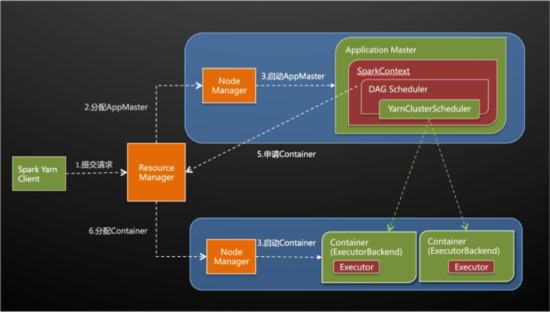
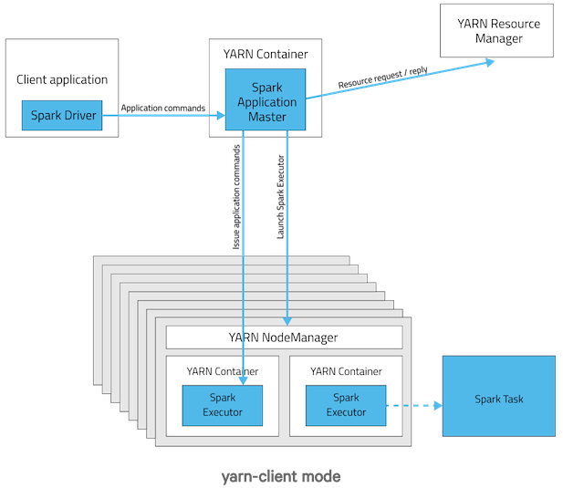

# Hadoop Yarn
## 背景(解决了什么问题：资源管理) 
> 在yarn出现之前，资源管理和任务管理耦合在一起(都在master上面)，集群的可扩展性，可靠性(单点故障)很差，而且资源的利用率很大
> Yarn的结构中，把原来JobTracker管的两部分功能(资源管理，任务调度)拆开了，资源调度由ResourceManager，任务调度让Application Master负责，让各个模块各司其职

## 架构
### ResourceManager
> ResourceManager是整个Yarn架构的核心部件，有且仅有一个，负责集群的资源(CPU，内存)的调度
> 完成了什么功能(类似于增删改查)：
1. NODE_REMOVED
> 事件NODE_REMOVED表示集群中被移除一个计算节点（可能是节点故障或者管理员主动移除），资源调度器收到该事件时需要从可分配资源总量中移除相应的资源量

2. NODE_ADDED
> 事件NODE_ADDED表示集群中增加了一个计算节点，资源调度器收到该事件时需要将新增的资源量添加到可分配资源总量中

3. APPLICATION_ADDED
> 事件APPLICATION_ADDED 表示ResourceManager收到一个新的Application。通常而言，资源管理器需要为每个application维护一个独立的数据结 构，以便于统一管理和资源分配。资源管理器需将该Application添加到相应的数据结构中

4. APPLICATION_REMOVED
> 事件APPLICATION_REMOVED表示一个Application运行结束（可能成功或者失败），资源管理器需将该Application从相应的数据结构中清除

5. CONTAINER_EXPIRED
> 当资源调度器将一个container分配给某个ApplicationMaster后，如果该ApplicationMaster在一定时间间隔内没有使用该container，则资源调度器会对该container进行再分配

6. NODE_UPDATE
> NodeManager 通过心跳机制向ResourceManager汇报各个container运行情况，会触发一个NODE_UDDATE事件，由于此时可能有新的 container得到释放，因此该事件会触发资源分配，也就是说，该事件是6个事件中最重要的事件，它会触发资源调度器最核心的资源分配机制

### ApplicationMaster
> ApplicationMaster 负责管理应用程序的整个生命周期，每个应用程序都对应一个AM，主要实现的功能有
    (1) 与RM的调度器通讯，协商管理资源分配。
    (2) 与NM合作，在合适的容器中运行对应的task，并监控这些task执行。
    (3) 如果container出现故障，AM会重新向调度器申请资源。
    (4) 计算应用程序所需的资源量，并转化成调度器可识别的协议。
    (5) AM出现故障后，ASM会重启它，而由AM自己从之前保存的应用程序执行状态中恢复应用程序

### NodeManager
> 每个节点(Worker)都会有一个NM, 主要实现的功能:
(1) 为应用程序启动容器，同时确保申请的容器使用的资源不会超过节点的资源
(2) 为task构建容器环境，包括二进制可执行文件，jar
(3) 为所在的节点提供了一个管理本地存储资源的简单服务，应用程序可以继续使用本地存储资源即使他没有从RM那申请。比如：MapReduce可以使用该服务程序存储map task的中间输出结果。

### Container
(1) Container是YARN中资源的抽象，它封装了某个节点上一定量的资源（CPU和内存两类资源）。它跟Linux Container没有任何关系，仅仅是YARN提出的一个概念（从实现上看，可看做一个可序列化/反序列化的Java类）。
(2) Container由ApplicationMaster向ResourceManager申请的，由ResouceManager中的资源调度器异步分配给ApplicationMaster；
(3) Container的运行是由ApplicationMaster向资源所在的NodeManager发起的，Container运行时需提供内部执行的 任务命令（可以使任何命令，比如java、Python、C++进程启动命令均可）以及该命令执行所需的环境变量和外部资源（比如词典文件、可执行文件、 jar包等）
> Container主要实现功能，一个应用程序所包含的Container包括两类：
(1) 运行ApplicationMaster的Container，由ResourceManager申请和提交的
(2) 运行各类任务的Container，由ApplicationMaster向NodeManager申请的，由Application根Container通信以启动之

## Yarn和Spark的搭配
1. Yarn的Node对应Spark的worker，并且每个Node都会有一个NodeManager
2. Yarn的Application master对应Spark的master，负责资源的申请和
3. Yarn的container对应Spark的Executor(实际上都是对应一个jvn进程)
## yarn-client和yarn-cluster
> 这是yarn上两种运行模式，这两种模式的最大的区别是体现在Application master。
> 所以首先说一说Application master

### application master
> 在yarn中，每一个application都会有一个application master进程(Spark Standalone也存在一个master，这是对应的)
> 它是Application申请的第一个container，用于运行Application master(以下简称为AM)
> 负责与ResourceManager打交道，请求资源并在获取资源之后告诉NodeManager启动对应的Container
> yarn cluster中，driver运行在AM上面，之后由AM负责申请资源，划分task, 分发task, 并与Container进行通信，提交成功之后，client可以直接关闭。

### yarn-cluster模式如下

> 最关键的地方在于Dirver在AM中运行，所以提交完任务，client就可以随时关闭了。
> 其步骤如下：
1. client向ResourceManager(以下简称RM)提交请求，并上传jar到HDFS上,这期间包括四步：
    a) 连接到RM
    b) 从RM ASM(ApplicationsManager)中获得metric, resource等信息
    c) upload app jar and spark-assembly jar 到HDFS
    d) 设置运行环境和container上下文
2. RM向NM申请资源，创建Spark的AM
3. NM启动AM，然后向ResourceManager AsM注册
4. AM向RM申请资源，然后RM通知NodeManager是分配container, 然后RM会收到container返回的信息, RM再把container信息返回给application
5. AM从HDFS中获取jar包，初始化SparkContext(即为驱动Driver), 并启动DAG schduler 和 YARN Cluster Scheduler(在standalone中称为taskScheduler)，切分称为taskSet,并发给container运行
6. AM 直接和container（executor）进行交互，完成这个分布式任务

### yarn-client的模式如下

> 关键的地方在于Driver不在AM, AM只负责神申请资源，
> driver(位于client上面)负责和Container的交互，以及最终结果的汇总
> 将终端kill掉，相当于kill整个程序

