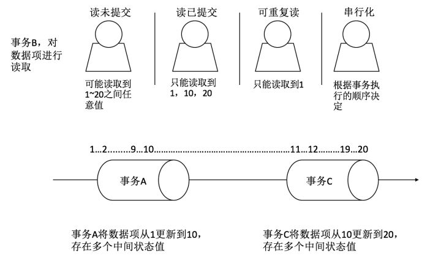

# 数据库基础
## 事务
事务是由一系列对系统中数据进行访问与更新的操作所组成的一个程序执行逻辑单元，狭义上的事务特指数据库事务。举个例子来说，张三给李四转了1000元钱，那么在数据库操作时，就要先把张三的账户减去1000元，再把李四的账户加上1000元，两部分操作放在一起，才是一个完整的转账过程，也可称之为事务。
## 数据库的ACID原则
> 指的是数据库在写入或者更新的时候，为保证事务正确可靠，必须具备的四个要素的缩写：
1. 原子性(Atomicity)
> 一个事务（transaction）中的所有操作，要么全部完成，要么全部不完成，不会结束在中间某个环节。事务在执行过程中发生错误，会被回滚（Rollback）到事务开始前的状态，就像这个事务从来没有执行过一样
> 以上面的例子举例：张三减去1000元，李四加上1000元，这两个操作要么都成功或失败，一旦有操作失败，则将已执行的操作回滚至操作之前。
2. 一致性(consistency)
> 在事务开始之前和事务结束以后，数据库的完整性没有被破坏。这表示写入的资料必须完全符合所有的预设规则，这包含资料的精确度、串联性以及后续数据库可以自发性地完成预定的工作。
> 上面的例子中，张三和李四的钱加起来总数是不变的。
3. 隔离性(isolation)
> 数据库允许多个并发事务同时对其数据进行读写和修改的能力，隔离性可以防止多个事务并发执行时由于交叉执行而导致数据的不一致。事务隔离分为不同级别，包括读未提交（Read uncommitted）、读提交（read committed）、可重复读（repeatable read）和串行化（Serializable）。
> 并发环境中，事务之间是相互隔离的
4. 持久性(durability)
> 持久性：事务处理结束后，对数据的修改就是永久的，即便系统故障也不会丢失。
> 即对数据库做出的改变的永久的

### 脏读：事务读取了另一个事务还未提交的数据
> 事务A和事务B同时执行，事务A在执行过程中，将某个数据值从0加到10，然后将事务提交
> 在此过程中，事务B进行一次读取，可能会出现[0, 10]中的任何值
> 脏读的重点在于，事务B读取了事务A正在修改时的数据
### 不可重复读：事务两次读取同一数据，内容不同
> 是指在一个事务内，多次读同一数据。在这个事务还没有结束时，另外一个事务也访问该同一数据。那么，在第一个事务中的两 次读数据之间，由于第二个事务的修改，那么第一个事务两次读到的的数据可能是不一样的。这样就发生了在一个事务内两次读到的数据是不一样的，因此称为是不可重复读
> 不可重复读，指的是多次读取数据，读到了别的事务修改后的内容
### 幻读： 事务读到了别的事务插入的数据，导致前后读取记录数不同
> 假设事务A对一个表中的某个数据项设置为1，这种修改涉及到表中的全部数据行，与此同时，事务B向表中插入一条新的数据且该数据项为2，那么此时操作事务A的用户就会发现表中有一条数据的该数据项居然不是1，好像发生了幻觉

### 事务隔离
1. 读未提交:最低级别，以上问题均无法解决。
2. 读已提交: 可避免脏读情况的发生
3. 可重复读取：可避免脏读、不可重复读情况的发生。保证在事务的处理过程中，多次读取同一个数据的时候，其值都和事务开始的时候是一致的。这也是为何下图中只能读取到1的原因
4. 最严格的事务隔离级别，要求所有事务被串行执行，不能并发执行，可避免脏读、不可重复读、幻读情况的发生。
> 示意见下图

## 索引
> 计算机学科中的索引有很多种，数组，哈希表，平衡树，红黑树，B树等等，通俗来讲，索引是能够加快查找数据速度的工具
> 常见的数据库系统，索引使用的数据结构多是B-Tree和B+Tree,mysql使用的数据结构是B+Tree, Oracle及Sysbase使用的是B-Tree
### 什么是索引
> 在数据库中，它是用于提高数据库表数据访问速度的数据库对象，一般来说，使用索引会提高查询的效率，但会降低插入和更新的速率
### B-Tree

## 数据库锁
> 
## 悲观锁和乐观锁
> 乐观并发控制(乐观锁)和悲观并发控制(悲观锁)是并发控制主要采用的手段
> 无论是悲观锁还是乐观锁，都是人们定义出来的概念，可以认为是一种思想
> 不要与数据库的锁机制(行锁，表锁，排它锁，共享锁)混为一谈
> 实际上，DBMS中的悲观锁往往是利用数据库提供的锁机制
### 悲观锁
> 数据库中的悲观锁流程如下:
i. 在对任意记录进行修改前，先尝试为该记录加上排他锁（exclusive locking）
ii. 如果加锁失败，说明该记录正在被修改，那么当前查询可能要等待或者抛出异常。 具体响应方式由开发者根据实际需要决定。
iii. 如果成功加锁，那么就可以对记录做修改，事务完成后就会解锁了。
iv. 其间如果有其他对该记录做修改或加排他锁的操作，都会等待我们解锁或直接抛出异常。
> 优点和不足
悲观并发控制实际上是“先取锁再访问”的保守策略，为数据处理的安全提供了保证。但是在效率方面，处理加锁的机制会让数据库产生额外的开销，还有增加产生死锁的机会；另外，在只读型事务处理中由于不会产生冲突，也没必要使用锁，这样做只能增加系统负载；还有会降低了并行性，一个事务如果锁定了某行数据，其他事务就必须等待该事务处理完才可以处理那行数
### 乐观锁
> 它假设多用户并发的事务在处理时不会彼此互相影响，各事务能够在不产生锁的情况下处理各自影响的那部分数据。在提交数据更新之前，每个事务会先检查在该事务读取数据后，有没有其他事务又修改了该数据。如果其他事务有更新的话，正在提交的事务会进行回滚
> 乐观锁（ Optimistic Locking ） 相对悲观锁而言，乐观锁假设认为数据一般情况下不会造成冲突，所以在数据进行提交更新的时候，才会正式对数据的冲突与否进行检测，如果发现冲突了，则让返回用户错误的信息，让用户决定如何去做
> 乐观锁不使用数据库提供的锁机制，一般通过数据版本的方式实现乐观锁
> 实现数据版本有两种方式：(1) 一种是通过版本号 (2) 另一种是通过时间戳的方式
> 当读取数据时，将版本标识的值一同读出，数据每更新一次，同时对版本标识进行更新。当我们提交更新的时候，判断数据库表对应记录的当前版本信息与第一次取出来的版本标识进行比对，如果数据库表当前版本号与第一次取出来的版本标识值相等，则予以更新，否则认为是过期数据,不更新，返回给用户决定是否要更新。
> 优点与不足
乐观并发控制相信事务之间的数据竞争(data race)的概率是比较小的，因此尽可能直接做下去，直到提交的时候才去锁定，所以不会产生任何锁和死锁。但如果直接简单这么做，还是有可能会遇到不可预期的结果，例如两个事务都读取了数据库的某一行，经过修改以后写回数据库，这时就遇到了问题。

## 数据库三大范式
### 第一范式
> 数据库中的字段都是单一属性，不可再分，这个单一属性由基本类型组成，包括整数，实数，字符型等类型
### 第二范式
  函数依赖: 若在一张表里，一旦确定了属性(组)X的值，那么Y的值已经确定，记作X->Y
  完全函数依赖: 如果X->Y,而且对于X的任一真子集x,x->Y都不成立(X为单属性时必然满足)
> 部分函数依赖: 如果X->Y,且Y不完全依赖于X
> 传递函数依赖: 如果X->Y, Y->Z(且Y不包含于X, X不函数依赖于Y),则称Z依赖传递于X
> 码：假如当 K 确定的情况下，该表除 K 之外的所有属性的值也就随之确定，那么 K 就是码
> 主属性：码中的属性称为主属性，不在码中的属性称为非主属性
> 第二范式定义
数据库表中不存在非主属性对任一主属性的部分函数依赖
### 第三范式
在第二范式的基础上，数据库中不存在非主属性对任一主属性的传递函数依赖
### 举例说明
> 一个学生表：其字段包括:
> 学号 # 姓名 # 系名 # 系主任 # 课名 # 分数

> 首先，该表符合1NF的设计
> 然而如果按这样的方式进行设计，必然导致数据冗余过多, 插入异常等问题
> 先看看该表是否满足第二范式
> 第一步，找出表的码：(学号，课名)
> 第二步，根据码找出主属性：学号，课名
> 第三步，去掉主属性，剩余的均为非主属性
> 第四步，观察非主属性是否部分依赖于主属性

> 对于姓名:(学号，课名) -> 姓名，有学号->姓名，所以为部分函数依赖
> 对于系名:(学号，课名) -> 系名，有学号->系名，所以为部分函数依赖
> 对于系主任:(学号，课名) -> 系主任，有学号->系主任，所以为部分函数依赖
> 对于分数: (学号，课名) -> 分数，为完全函数依赖

> 消除函数依赖，可以利用模式拆分
> 将满足部分函数依赖的字段拆分成小表
>利用函数依赖进行拆分
表1：学号 # 课名 # 分数
表2：学号 # 姓名 # 系名 # 系主任
> 此时表1和表2均满足第二范式
> 再看该表是否满足第三范式：
很明显存在传递关系，学号 -> 系名 -> 系主任
所以不符合第三范式，继续拆分
将表2拆分成：
表2： 学号 # 姓名 # 系名
表3： 系名 # 系主任
> 此时的三个表均满足第一第二第三范式

