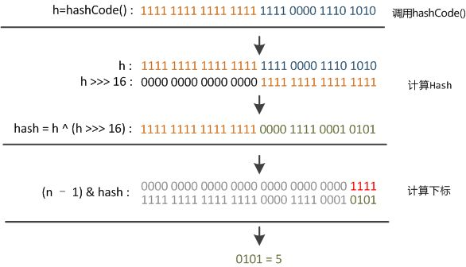

# 什么叫Map
> Map是一种关联数组的结构，叫字典或者键值对
> JAVA中常用的有HashMap, HashTable, TreeMap(保持Key值有序)
# 为什么要用Map
> 线性表可以描述现实中的线性结构，树可以描述显示生活中的层次结构，而为了描述映射关系，我们需要一种能描述Key-Value的数据结构
> Map在查询，增加，删除上的效率都很高，时间复杂度为O(N/Buckets.size),Buckets表示槽, 如果只有一个槽，HashMap就退化到了简单的链表结构，复杂度为O(N)

# JAVA的HashMap原码解读
## 什么叫HashMap
> HashMap是一种基于Hash Table(哈希表)的Map，哈希表也叫关联数组，key值经过一个Hash函数得到一个槽(Buckets)的索引，里面保存着我们需要的实际值，而Key值由实际值计算而来。
> 
------------------------------------

## 为什么使用HashMap
> HashMap是非常实用的一种数据结构，可以极大的减少查询的时间复杂度。

## Java源码解读
> HashMap的关键在，如果一个不同的key值经过hash函数产生了相同的hash值，就会产生对应所谓的哈希冲突(最简单的hash函数就是取余运算，hash(x) = x mod m), 如果m的值小于x的量，那么必然会产生哈希冲突)，所以HashMap的关键就在于解决哈希冲突，所以需要解决的问题是：
* 选取适当的函数，使得产生的冲突尽量少
* 出现冲突之后怎么解决
> 所以解读最关键的就是HashMap如何解决这两个问题的

### 构造函数
> HashMap有三个构造函数，我们平时最常用的是new HashMap<>()
>
    public HashMap(int initialCapacity, float loadFactor) {
        if (initialCapacity < 0)
            throw new IllegalArgumentException("Illegal initial capacity: " +
                                            initialCapacity);
        if (initialCapacity > MAXIMUM_CAPACITY)
            initialCapacity = MAXIMUM_CAPACITY;
        if (loadFactor <= 0 || Float.isNaN(loadFactor))
            throw new IllegalArgumentException("Illegal load factor: " +
                                            loadFactor);
        this.loadFactor = loadFactor;
        threshold = initialCapacity;
        init();
    }
    public HashMap(int initialCapacity) {
        this(initialCapacity, DEFAULT_LOAD_FACTOR);
    }
    public HashMap() {
        this(DEFAULT_INITIAL_CAPACITY, DEFAULT_LOAD_FACTOR);
    }
> 还有两个参数可以设置hashMap的容量(capacity)和平衡因子(loadFactor)
>
    /**
    * The default initial capacity - MUST be a power of two.
    */
    static final int DEFAULT_INITIAL_CAPACITY = 1 << 4; // aka 16
    /**
    * The maximum capacity, used if a higher value is implicitly specified
    * by either of the constructors with arguments.
    * MUST be a power of two <= 1<<30.
    */
    static final int MAXIMUM_CAPACITY = 1 << 30;
    /**
    * The load factor used when none specified in constructor.
    */
    static final float DEFAULT_LOAD_FACTOR = 0.75f;
> capicity和loadFactor都存在默认值，capcity的默认值是16，loadFactor的默认值为0.75
> loadFactor的作用是，当存储的元素数目 > capcity * loadFactor时，HashMap会进行扩容的操作 
> 0.75是综合考虑了操作时间复杂度和存储空间，过高的loadFactor会降低查找等操作的时间复杂度，过低的loadFactor会频繁扩容，导致存储空间过大。
> capcity存在最大值为2^30，考虑到内存的使用
### hash函数
> 在java1.7中是这么实现的
>
    final int hash(Object k) {
        int h = hashSeed;
        if (0 != h && k instanceof String) {
            return sun.misc.Hashing.stringHash32((String) k);
        }
        h ^= k.hashCode();
        h ^= (h >>> 20) ^ (h >>> 12);
        return h ^ (h >>> 7) ^ (h >>> 4);
    }
> java1.8中是这么实现的
>
    static final int hash(Object key) {
        int h;
        return (key == null) ? 0 : (h = key.hashCode()) ^ (h >>> 16);
    }

> 在java1.7中，做大量(4次)的异或与无符号位移组合运算是为了增加hash函数的随机性和分布均匀性，这是为了增加干扰而减少哈希冲突
> 在java8中改成了只使用一次干扰，可能是考虑做多了效应的提升不那么明显，而且效率不高，所以改为只做一个干扰处理
### 取索引
> 
    static int indexFor(int h, int length) {
        return h & (length-1);
    }
> 设hashMap的bucket为length,那么为了使得计算的hash值能映射到数组上面[0, length)，一般的做法有两种：
1 令length为素数，index = hashcode mod length // 取余运算
2 令length为2的幂次，index = hashcode & (length - 1) // 按位与
> HashMap采用第2种方式，HashTable采用第1种方式实现
> 第一种方式: 取余法，为什么要用素数？
> 我的理解，如果数据都是均匀分布的话，那么取不取素数都为所谓。然而如果实际数据是个等差数据，即k+rp的方式的一组数，那么p为合数的概率会比较大，如果取一个合数的余数，导致碰撞的概率会比较大，取素数可以减少碰撞的概率
> 我们观察一下第二种方式，利用位与运算获得，而length如果取2^K，那么length-1的尾部k位均为1，其余为0，用这样的方式进行做与运算，会保留后K位，即值会取在[0, length)中，这就是为什么一开始，capcity要取2的幂次了。
> 值的范围没问题，但是另一个问题出来了，就算hash值分布很分散，只取尾部K尾形成的hash值，分散性就无从谈起，碰撞依然很严重，为了解决这个问题，才想出的无符号右移和异或运算。
> 我们研究一次无符号右移和异或的组合，就能明白为什么这么做能增加随机性和分布均匀性，从而减少冲突
> 
> 假设数据类型为int, 那么转换成二进制就是32位，将hash码无符号右移16位，然后与原hashcode做异或运算，相当于将hashcode的高低位进行混合，以此来增大低位的随机性，(用右移的方式然后做异或操作, 能将高位与低位混合,是一种压缩的逻辑,将高位的信息变相保留下来，很妙)

### Entry对象
> HashMap中存储的是Entry对象，实际上，Entry对象实现了Map.Entry()接口
> Entry对象的本质就是一个链表的Node节点，HashMap是对一个Entry数组的封装，我们来看看Entry的结构
>
    static class Entry<K,V> implements Map.Entry<K,V> {
        final K key;//键值不可变
        V value;
        Entry<K,V> next;//实现指针
        int hash;

        /**
        * Creates new entry.
        */
        Entry(int h, K k, V v, Entry<K,V> n) {
            value = v;
            next = n;
            key = k;
            hash = h;
        }

        public final K getKey() {
            return key;
        }

        public final V getValue() {
            return value;
        }

        public final V setValue(V newValue) {
            V oldValue = value;
            value = newValue;
            return oldValue;
        }

        public final boolean equals(Object o) {
            if (!(o instanceof Map.Entry))
                return false;
            Map.Entry e = (Map.Entry)o;
            Object k1 = getKey();
            Object k2 = e.getKey();
            if (k1 == k2 || (k1 != null && k1.equals(k2))) {
                Object v1 = getValue();
                Object v2 = e.getValue();
                if (v1 == v2 || (v1 != null && v1.equals(v2)))
                    return true;
            }
            return false;
        }

        public final int hashCode() {
            return Objects.hashCode(getKey()) ^ Objects.hashCode(getValue());
        }

        public final String toString() {
            return getKey() + "=" + getValue();
        }

        /**
        * This method is invoked whenever the value in an entry is
        * overwritten by an invocation of put(k,v) for a key k that's already
        * in the HashMap.
        */
        void recordAccess(HashMap<K,V> m) {
        }

        /**
        * This method is invoked whenever the entry is
        * removed from the table.
        */
        void recordRemoval(HashMap<K,V> m) {
        }
    }

> K,V表示泛型的概念
> 从构造函数来看，Entry类似于单链表的结点，结点内存储的信息包括：
> key, value, hash, next, next负责将同一个key值的连起来
> h是啥意思？

### table对象
> 
    /**
    * The table, resized as necessary. Length MUST Always be a power of two.
    */
    transient Entry<K,V>[] table = (Entry<K,V>[]) EMPTY_TABLE;
> 这是HashMap最核心的一个结构，即Entry<K,V>为类型的数组
> 这个table会在put的时候进行重新初始化

### put操作(增加操作)
>
    public V put(K key, V value) {
        if (table == EMPTY_TABLE) {
            inflateTable(threshold);
        }
        if (key == null)
            return putForNullKey(value);
        int hash = hash(key);
        int i = indexFor(hash, table.length);
        for (Entry<K,V> e = table[i]; e != null; e = e.next) {
            Object k;
            if (e.hash == hash && ((k = e.key) == key || key.equals(k))) {//已存在key 更新值
                V oldValue = e.value;
                e.value = value;
                e.recordAccess(this);
                return oldValue;//返回被覆盖的那个值
            }
        }

        modCount++;
        addEntry(hash, key, value, i);
        return null;
    }

    /**
    * Inflates the table.//初始化新的table
    */
    private void inflateTable(int toSize) {
        // Find a power of 2 >= toSize
        int capacity = roundUpToPowerOf2(toSize);

        threshold = (int) Math.min(capacity * loadFactor, MAXIMUM_CAPACITY + 1);
        table = new Entry[capacity];
        initHashSeedAsNeeded(capacity);
    }

    /**
    * Offloaded version of put for null keys
    */
    private V putForNullKey(V value) {
        for (Entry<K,V> e = table[0]; e != null; e = e.next) {
            if (e.key == null) {//已存在key 更新值
                V oldValue = e.value;
                e.value = value;
                e.recordAccess(this);
                return oldValue;
            }
        }
        modCount++;
        addEntry(0, null, value, 0);
        return null;
    }

    /**
    * Adds a new entry with the specified key, value and hash code to
    * the specified bucket.  It is the responsibility of this
    * method to resize the table if appropriate.
    *
    * Subclass overrides this to alter the behavior of put method.
    */
    void addEntry(int hash, K key, V value, int bucketIndex) {
        if ((size >= threshold) && (null != table[bucketIndex])) {//当size>threshold时 将会进行扩容和rehash
            resize(2 * table.length);//2倍扩容
            hash = (null != key) ? hash(key) : 0;
            bucketIndex = indexFor(hash, table.length);
        }

        createEntry(hash, key, value, bucketIndex);
    }

    /**
    * Like addEntry except that this version is used when creating entries
    * as part of Map construction or "pseudo-construction" (cloning,
    * deserialization).  This version needn't worry about resizing the table.
    *
    * Subclass overrides this to alter the behavior of HashMap(Map),
    * clone, and readObject.
    */
    void createEntry(int hash, K key, V value, int bucketIndex) {
        Entry<K,V> e = table[bucketIndex];
        table[bucketIndex] = new Entry<>(hash, key, value, e);
        size++;
    }

    /**
    * Rehashes the contents of this map into a new array with a
    * larger capacity.  This method is called automatically when the
    * number of keys in this map reaches its threshold.
    *
    * If current capacity is MAXIMUM_CAPACITY, this method does not
    * resize the map, but sets threshold to Integer.MAX_VALUE.
    * This has the effect of preventing future calls.
    *
    * @param newCapacity the new capacity, MUST be a power of two;
    *        must be greater than current capacity unless current
    *        capacity is MAXIMUM_CAPACITY (in which case value
    *        is irrelevant).
    */
    void resize(int newCapacity) {
        Entry[] oldTable = table;
        int oldCapacity = oldTable.length;
        if (oldCapacity == MAXIMUM_CAPACITY) {
            threshold = Integer.MAX_VALUE;
            return;
        }

        Entry[] newTable = new Entry[newCapacity];
        transfer(newTable, initHashSeedAsNeeded(newCapacity));
        table = newTable;
        threshold = (int)Math.min(newCapacity * loadFactor, MAXIMUM_CAPACITY + 1);
    }

    //rehash
    /**
    * Transfers all entries from current table to newTable.
    */
    void transfer(Entry[] newTable, boolean rehash) {
        int newCapacity = newTable.length;
        for (Entry<K,V> e : table) {
            while(null != e) {
                Entry<K,V> next = e.next;
                if (rehash) {
                    e.hash = null == e.key ? 0 : hash(e.key);
                }
                int i = indexFor(e.hash, newCapacity);
                e.next = newTable[i];
                newTable[i] = e;
                e = next;
            }
        }
    }
> 看这个put确实设计的很厉害，该部分的包含了增加和更新两种情况
> 参数(已知量)：key, value 都是引用类型
> 输出：增加的value
> 过程:
* 如果表为空，就扩充表
* 计算key的hashcode，然后计算获得tableIndex
* 遍历Table[tableIndex]对应的链表，如果发现key值相同，采用equal进行比较，那么更新对应Entry的值
* 如果未发现相同的key值，创造Entry，根据tableIndex，将该Entry插到对应的链表表头
> 流程图可以用这个表示
>    
### remove操作(删除操作)
> 
    public V remove(Object key) {
        Entry<K,V> e = removeEntryForKey(key);
        return (e == null ? null : e.value);
    }
    final Entry<K,V> removeEntryForKey(Object key) {
        if (size == 0) {
            return null;
        }
        int hash = (key == null) ? 0 : hash(key);
        int i = indexFor(hash, table.length);//桶号
        Entry<K,V> prev = table[i];
        Entry<K,V> e = prev;
        while (e != null) {
            Entry<K,V> next = e.next;
            Object k;
            if (e.hash == hash &&
                ((k = e.key) == key || (key != null && key.equals(k)))) {//通过equals方法进行key的查找
                modCount++;
                size--;
                if (prev == e)
                    table[i] = next;
                else
                    prev.next = next;
                e.recordRemoval(this);
                return e;
            }
            prev = e;
            e = next;
        }

        return e;
    }
> 删除的操作比较简单，找到表的索引值index之后，就可以确定头结点table[index];
> 删除链表需要记录prev,以便进行删除操作
> 然后遍历该链表，删除对应的节点，注意没有头指针的删除方法，注意是不是头结点需要分情况讨论
### 查找操作
> 
    public V get(Object key) {
        if (key == null)
            return getForNullKey();
        Entry<K,V> entry = getEntry(key);

        return null == entry ? null : entry.getValue();
    }

    /**
    * Offloaded version of get() to look up null keys.  Null keys map
    * to index 0.  This null case is split out into separate methods
    * for the sake of performance in the two most commonly used
    * operations (get and put), but incorporated with conditionals in
    * others.
    */
    private V getForNullKey() {//当查询的key为null的时候 需要遍历这个table[0]链表进行查找
        if (size == 0) {
            return null;
        }
        for (Entry<K,V> e = table[0]; e != null; e = e.next) {
            if (e.key == null)
                return e.value;
        }
        return null;
    }

    /**
    * Returns <tt>true</tt> if this map contains a mapping for the
    * specified key.
    *
    * @param   key   The key whose presence in this map is to be tested
    * @return <tt>true</tt> if this map contains a mapping for the specified
    * key.
    */
    public boolean containsKey(Object key) {
        return getEntry(key) != null;
    }

    /**
    * Returns the entry associated with the specified key in the
    * HashMap.  Returns null if the HashMap contains no mapping
    * for the key.
    */
    final Entry<K,V> getEntry(Object key) {
        if (size == 0) {
            return null;
        }

        int hash = (key == null) ? 0 : hash(key);
        for (Entry<K,V> e = table[indexFor(hash, table.length)];
            e != null;
            e = e.next) {
            Object k;
            if (e.hash == hash &&
                ((k = e.key) == key || (key != null && key.equals(k))))
                return e;
        }
        return null;
    }

> 查找函数的主体在于，getEntry函数，无论是get函数containsKey都是调用该函数
> getEntry的主要思路，就是获取index，然后遍历链表获取对应key值的entry

### 总结
* HashMap不是线程安全的类
    > 在hashmap做put操作的时候会调用到以上的方法。现在假如A线程和B线程同时对同一个数组位置调用addEntry，两个线程会同时得到现在的头结点，然后A写入新的头结点之后，B也写入新的头结点，那B的写入操作就会覆盖A的写入操作造成A的写入操作丢失
    >当多个线程同时操作同一个数组位置的时候，也都会先取得现在状态下该位置存储的头结点，然后各自去进行计算操作，之后再把结果写会到该数组位置去，其实写回的时候可能其他的线程已经就把这个位置给修改过了，就会覆盖其他线程的修改
    >当多个线程同时检测到总数量超过门限值的时候就会同时调用resize操作，各自生成新的数组并rehash后赋给该map底层的数组table，结果最终只有最后一个线程生成的新数组被赋给table变量，其他线程的均会丢失。而且当某些线程已经完成赋值而其他线程刚开始的时候，就会用已经被赋值的table作为原始数组，这样也会有问题。
* HashMap是基于数组加链表的形式实现的
* HashMap支持null键和值
* HashMap在size>=table.length*loadFactor时会进行2倍扩容
* HashMap的get,put,remove复杂度近似O(1)
* loadFactor是优化的重要参数，loadFactor越大，hash冲突的概率越大，table的利用率越大，反之都越小

