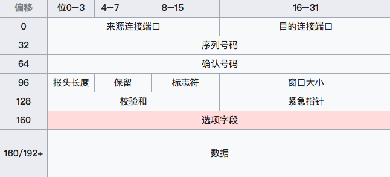

# 计算机网络
> 计算机网络是面试中经常面试到的内容，本文总结一下一些常用的注意点

## TCP/UDP区别
> TCP和UDP都是位于传输层的协议；
> TCP协议是面向连接，可靠的，基于字节流的传输层通信协议；
> UDP是一个简单的面向数据报的传输层协议。

> 两者的区别大致如下：
1. TCP是面向连接的，UDP是面向非连接的，发送数据前不需要建立连接
2. TCP提供可靠的服务(数据传输)(为什么TCP是可靠的？)，UDP无法保证
3. TCP面向字节流，UDP面向报文(有报文边界)
4. TCP传输速度慢，UDP传输速度快

## 常用的端口以及对应的应用层协议
1. 21：FTP(文件传输协议)
2. 22：SSH(安全登录协议)
3. 23：Telnet(远程登录协议)
4. 25：SMTP(简单邮件传输协议)
5. 53：DNS(地址解析洗衣)
6. 80：HTTP(超文本解析协议)
7. 110：POP3(邮件协议3)
8. 443：HTTPS
9. 1080：SOCKET
10. 1521：Oracle数据库默认端口
11. 3306：MYSQL服务

## 三次握手协议、四次挥手协议
> 三次握手协议和四次挥手协议是TCP建立安全可靠的连接的非常重要的内容。
> 其主要过程见下图：

### 三次握手协议
1. Client向Server端发送SYN包(什么叫SYN包?)，将序列号设置为A，Client随即进入SYN_SEND状态
2. Server向Client端发送SYN/ACK包(什么叫ACK包?)，ACK确认码为A+1, 将序列号设置为B，Server随即进入SYN_RECEIVED
3. 最后，客户端再发送一个ACK包，当Server端收到后，就完成了三路握手，进入ESTABLISHED状态，此时序号被设定为A+1，确认号为B+1

> 解释一下，什么叫SYN包，我们来看看数据包的结构：

> 来源连接端口号(16位长度)：辨识发送连接端口;

> 目的连接端口号(16位长度)：辨识接收连接端口;

> 序列号(32位长度)：Seq;
    1. 如果含有同步化旗标(SYN)，则此为最原始的序列号；第一个数据比特的序列码为本序列号+1(即建立连接后的A+1)
    2. 如果不含有同步化旗标，则此为第一个数据比特的序列码

> 确认号(32位长度)：ACK;收到的序列号+1

> 报头长度(4位长度)：以四字节为单位计算数据段开始地址的偏移量

> 保留(4位长度)：置为0

> 标识符：
    URG—为1表示高优先级数据包，紧急指针字段有效。
    ACK—为1表示确认号字段有效
    PSH—为1表示是带有PUSH标志的数据，指示接收方应该尽快将这个报文段交给应用层而不用等待缓冲区装满。
    RST—为1表示出现严重差错。可能需要重现创建TCP连接。还可以用于拒绝非法的报文段和拒绝连接请求。
    SYN—为1表示这是连接请求或是连接接受请求，用于创建连接和使顺序号同步
    FIN—为1表示发送方没有数据要传输了，要求释放连接。

> 窗口(16位长度)：表示从确认号开始，本报文的接受方可以接收的字节数，即接收窗口大小。用于流量控制

> 检验和(16位长度)：对整个的TCP报文段，包括TCP头部和TCP数据，以16位字进行计算所得。这是一个强制性的字段。

> 紧急指针（16位长度）—本报文段中的紧急数据的最后一个字节的序号。
### 四次挥手协议
1. 主动关闭方发送FIN包，seq=x+2，ack=y+1，主动关闭方进入FIN_WAIT1状态(表示主动关闭方数据已经传输结束，但被动关闭方此时不一定结束)
2. 被动关闭方接收了FIN包之后，给主动关闭方发送了ACK包，ack码为x+3，被动关闭方进入CLOSE_WAIT状态
3. 主动关闭方接收到ACK包之后，进入FINAL_WAIT2状态
4. 被动关闭方发送FIN包，seq=y+1，然后进入LAST_ACK包
5. 主动关闭方接收到FIN包，然后发送ACK包，ack=y+2，主动关闭方进入TIME_WAIT
6. 被动关闭方接收到ACK包之后，连接彻底释放(如果一定时间范围内没接到ACK包，会进行重发，这也是TIME_WAIT的意义)

#### 注意点
1. 按照RFC 793，一个连接可以在TIME-WAIT保证最大四分钟，即最大分段寿命（maximum segment lifetime）的2倍
2. 如果服务器端接到了客户端发的SYN后回了SYN-ACK后客户端掉线了，默认会进行重新发送，linux下，一般会重连5次，5次的时间间隔为1s,2s,4s,8s,16s,32s,总计63秒

## TCP常用知识点
### 资源使用
> 主机收到一个TCP包时，用两端的IP地址与端口号来标识这个TCP包属于哪个session。
> 使用一个独一无二的四元组来标志属于哪个session(session表示一个连接，每个TCP包都会属于唯一一个session)
> Socket是用ip + 端口，主动连接方的Socket加上被动连接方(通常是服务端)Socket，即可组成一个Session

### 数据传输
> TCP的数据传输，很多重要的机制保证了TCP传输的稳健性和可靠性。(有哪些机制呢？)
1. 使用序号，对收到的TCP包进行排序以及检测重复的数据
2. 使用检验和检测报文段的错误，确保无错传输(error check)
3. 使用确认和计时器来检测和纠正丢包或延时
4. 流量控制（Flow control）
5. 拥塞控制（Congestion control）
6. 丢失包的重传

#### 序号控制
> 通常每个TCP报文都会有一个序列号和确认号。TCP报文发送者称自己的字节流为序列号，称接收到对方的字节流编号为确认号。

> TCP报文接受者为了确保可靠性，在接收到一定数量的连续字节流才会确认。这是对TCP的扩展，称为选择确认。
> 序号机制可以使得TCP接收者可以对乱序到达的数据块进行确认。每一个字节传输过后，ISN(初始序列号)都会递增1。

> 通过使用序号和确认号，TCP层可以把收到的报文段中的字节按正确的顺序交付给应用层。序号是32位的无符号数，在它增大到232-1时，便会回绕到0。对于ISN的选择是TCP中关键的一个操作，它可以确保强壮性和安全性。

> TCP协议使用序号（sequence number）标识每端发出的字节的顺序，从而另一端接收数据时可以重建顺序。无惧传输时的包的乱序交付或丢包。在发送第一个包时（SYN包），选择一个随机数作为序号的初值，以克制TCP序号预测攻击。(如果固定初始的话，截取到报文，就可以将字节流转换成真实报文？)

> 发送确认包(Acks)，携带了接收到的对方发来的字节流的编号，称为确认号，以告诉对方已经成功接收的数据流的字节位置。Ack并不意味着数据已经交付了上层应用程序。

> 可靠性通过发送方检测到丢失的传输数据并重传这些数据。包括超时重传（Retransmission timeout，RTO）与重复累计确认（duplicate cumulative acknowledgements，DupAcks）。

#### 基于重复累计确认的重传
> 如果一个包（不妨设它的序号是100，即该包始于第100字节）丢失，接收方就不能确认这个包及其以后的包，因为采用了累计ack。接收方在收到100以后的包时，发出对包含第99字节的包的确认。这种重复确认是包丢失的信号。发送方如果收到3次对同一个包的确认，就重传最后一个未被确认的包。阈值设为3被证实可以减少乱序包导致的无作用的重传（spurious retransmission）现象。[4] 选择性确认(SACK)的使用能明确反馈哪个包收到了，极大改善了TCP重传必要的包的能力。
(对应后面的快速重传，指的是不需要等到超时再进行重传，拥塞控制就有快速重传这个机制)
#### 超时重传
> 发送方使用一个保守估计的时间作为收到数据包的确认的超时上限。如果超过这个上限仍未收到确认包，发送方将重传这个数据包。每当发送方收到确认包后，会重置这个重传定时器。典型地，定时器的值设定为 {\displaystyle {\text{smoothed RTT}}+\max(G,4\times {\text{RTT variation}})} {\displaystyle {\text{smoothed RTT}}+\max(G,4\times {\text{RTT variation}})} 其中 {\displaystyle G} G是时钟粒度。进一步，如果重传定时器被触发，仍然没有收到确认包，定时器的值将被设为前次值的二倍（直到特定阈值）。这可对抗 中间人攻击方式的拒绝服务攻击，这种攻击愚弄发送者重传很多次导致接受者被压垮。

#### TCP数据传输举例
1. 发送方首先发送第一个包含序列号为1（可变化）和1460字节数据的TCP报文段给接收方。接收方以一个没有数据的TCP报文段来回复（只含报头），用确认号1461来表示已完全收到并请求下一个报文段。
2. 发送方然后发送第二个包含序列号为1461，长度为1460字节的数据的TCP报文段给接收方。正常情况下，接收方以一个没有数据的TCP报文段来回复，用确认号2921（1461+1460）来表示已完全收到并请求下一个报文段。发送接收这样继续下去。
3. 然而当这些数据包都是相连的情况下，接收方没有必要每一次都回应。比如，他收到第1到5条TCP报文段，只需回应第五条就行了。在例子中第3条TCP报文段被丢失了，所以尽管他收到了第4和5条，然而他只能回应第2条。
4. 发送方在发送了第三条以后，没能收到回应，因此当时钟（timer）过时（expire）时，他重发第三条。（每次发送者发送一条TCP报文段后，都会再次启动一次时钟：RTT）。
5. 这次第三条被成功接收，接收方可以直接确认第5条，因为4，5两条已收到。

#### 校验和
> 校验和才是确保传输数据无误的机制。
> TCP的16位检验和(checksum)的计算，发送者将TCP报文段的头部和数据部分的和计算出来，再对其求反码（一的补数），就得到了校验和，然后将结果装入报文中传输。(这种做法类似于一种校验，比如MD5也是常用的一种手段)
> 如果计算结果是全部为一，那么就表示了报文的完整性和正确性。

> 使用反码这种方式，使得进行多个报文进行汇总之后再进行校验，结果是一致的

> 注意点：

> TCP校验和也包括了96位的伪头部，其中有源地址、目的地址、协议以及TCP的长度。这可以避免报文被错误地路由。

#### 流量控制
> 首先就得说道接收方返回的ack包：ack包其实包含两个信息
1. 本次的确认号n，该确认号其实就是期待下一次发送方的序列号;
2. 当前的窗口大小m，根据该窗口计算还能发送多少字节

> 假设此次返回的ack包的窗口大小为m，确认号为n，此时发送方已经发送到了x字节，那么此次还能再发送多少字节？
    m - (x - n);

> 当接收方宣布接收窗口的值为0，发送方停止进一步发送数据，开始了“保持定时器”（persist timer），以避免因随后的修改接收窗口的数据包丢失使连接的双侧进入死锁，发送方无法发出数据直至收到接收方修改窗口的指示。当“保持定时器”到期时，TCP发送方尝试恢复发送一个小的ZWP包（Zero Window Probe），期待接收方回复一个带着新的接收窗口大小的确认包。一般ZWP包会设置成3次，如果3次过后还是0的话，有的TCP实现就会发RST把链接断了。

> TCP愚蠢窗口问题
如果接收方以很小的增量来处理到来的数据，它会发布一系列小的接收窗口。这被称作愚蠢窗口综合症，因为它在TCP的数据包中发送很少的一些字节，相对于TCP包头是很大的开销。解决这个问题，就要避免对小的window size做出响应，直到有足够大的window size再响应：
从接收端和发送端两个角度来预防：
1. 接收端使用David D Clark算法：如果收到的数据导致window size小于某个值，可以直接ack把window给关闭了，阻止了发送端再发数据。等到接收端处理了一些数据后windows size大于等于了MSS，或者接收端buffer有一半为空，就可以把window打开让发送端再发数据过来。
2. 发送端使用著名的Nagle算法来延时处理，条件一：Window Size>=MSS 或是 Data Size >=MSS；条件二：等待时间或是超时200ms，这两个条件有一个满足，才会发数据，否则就是在积累数据。Nagle算法默认是打开的，所以对于一些需要小包场景的程序——比如像telnet或ssh这样的交互性程序，需要关闭这个算法。可以在Socket设置TCP_NODELAY选项来关闭这个算法。

> 只有当发送端可发送且接收方可接收，才会有数据往来。

#### 拥塞控制
> 拥塞控制是发送方根据网络的承载情况控制分组的发送量，以获取高性能又能避免拥塞崩溃（congestion collapse，网络性能下降几个数量级）。这在网络流之间产生近似最大最小公平分配。
> 发送方与接收方根据确认包或者包丢失的情况，以及定时器，估计网络拥塞情况，从而修改数据流的行为，这称为拥塞控制或网络拥塞避免。
> TCP的现代实现包含四种相互影响的拥塞控制算法: 慢开始, 拥塞避免, 快重传, 快恢复 (RFC 5681).
此外，发送方采取“超时重传”（retransmission timeout，RTO），这是估计出来回通信延迟 (RTT) 以及RTT的方差。

> 慢开始与拥塞避免：
通常在刚刚开始发送报文段时，先把拥塞窗口 cwnd 设置为一个最大报文段MSS的数值。而在每收到一个对新的报文段的确认后，把拥塞窗口增加一倍。用这样的方法逐步增大发送方的拥塞窗口 cwnd ，可以使分组注入到网络的速率更加合理。

> 为了防止拥塞窗口cwnd增长过大引起网络拥塞，还需要设置一个慢开始门限ssthresh状态变量（如何设置ssthresh）。慢开始门限ssthresh的用法如下： 
1. 当 cwnd < ssthresh 时，使用上述的慢开始算法
2. 当 cwnd > ssthresh 时，停止使用慢开始算法而改用拥塞避免算法
3. 当 cwnd = ssthresh 时，既可使用慢开始算法，也可使用拥塞控制避免算法

> “拥塞避免”是说在拥塞避免阶段将拥塞窗口控制为按线性规律增长，使网络比较不容易出现拥塞，但也不能避免拥塞堵塞。

> 快速重传和快速恢复算法：

> 超时重传是TCP协议保证数据可靠性的一个重要机制，其原理是在发送一个数据以后就开启一个计时器，在一定时间内如果没有得到发送数据报的ACK报文，那么就重新发送数据，直到发送成功为止。这是数据包丢失的情况下给出的一种修补机制。一般来说，重传发生在超时之后，但是如果发送端接收到3个以上的重复ACK，就应该意识到，数据丢了，需要重新传递。这个机制不需要等到重传定时器溢出，所以叫做快速重传，而快速重传以后，因为走的不是慢启动而是拥塞避免算法，所以这又叫做快速恢复算法。

> 快速恢复指的是将ssthresh减半，然后将cwnd设置为sshthresh，然后直接进入拥塞避免算法，而非慢开始阶段。

#### 最大分段大小
> 最大分段大小 (MSS)是在单个分段中TCP愿意接受的数据的字节数最大值。MSS应当足够小以避免IP分片，它会导致丢包或过多的重传。在TCP连接创建时，双端在SYN报文中用MSS选项宣布各自的MSS，这是从双端各自直接相连的数据链路层的最大传输单元(MTU)的尺寸减去固定的IP首部和TCP首部长度。以太网MTU为1500字节， MSS值可达1460字节。使用IEEE 802.3的MTU为1492字节，MSS可达1452字节。如果目的IP地址为“非本地的”，MSS通常的默认值为536（这个默认值允许20字节的IP首部和20字节的TCP首部以适合576字节IP数据报）。此外，发送方可用传输路径MTU发现（见RFC 1191）推导出从发送方到接收方的网络路径上的最小MTU，以此动态调整MSS以避免网络IP分片。

> MSS发布也被称作“MSS协商”（MSS negotiation）。严格讲，这并非是协商出来一个统一的MSS值，TCP允许连接两端使用各自不同的MSS值。例如，这会发生在参与TCP连接的一台设备使用非常少的内存处理到来的TCP分组。

## ARP协议
> 首先，每台主机都会在自己的ARP缓冲区中建一个IP和MAC地址的映射。

> 当源主机需要将一个数据包要发送到目的主机时，会首先检查自己 ARP列表中是否存在该 IP地址对应的MAC地址，如果有，就直接将数据包发送到这个MAC地址；如果没有，就向本地网段发起一个ARP请求的广播包，查询此目的主机对应的MAC地址。此ARP请求数据包里包括源主机的IP地址、硬件地址、以及目的主机的IP地址。网络中所有的主机收到这个ARP请求后，会检查数据包中的目的IP是否和自己的IP地址一致。如果不相同就忽略此数据包；如果相同，该主机首先将发送端的MAC地址和IP地址添加到自己的ARP列表中，如果ARP表中已经存在该IP的信息，则将其覆盖，然后给源主机发送一个 ARP响应数据包，告诉对方自己是它需要查找的MAC地址；源主机收到这个ARP响应数据包后，将得到的目的主机的IP地址和MAC地址添加到自己的ARP列表中，并利用此信息开始数据的传输。如果源主机一直没有收到ARP响应数据包，表示ARP查询失败。

> 该协议是在数据链路层进行寻址的时候执行的，个人认为主要是在数据链路层上进行局域网内Mac寻址的时候使用。

## 路由选择协议
> 路由选择协议，主要目的是为了寻找IP地址所在的位置，常用的路由选择协议包括RIP协议和OSFP协议。

> RIP协议：底层是贝尔曼福特算法，它选择路由的度量标准（metric)是跳数，最大跳数是15跳，如果大于15跳，它就会丢弃数据包。

> OSPF协议：底层是迪杰斯特拉算法，是链路状态路由选择协议，它选择路由的度量标准是带宽，延迟。

## TCP/IP中，每一层对应的协议
> 网络层：IP协议、ICMP协议、ARP协议、RARP协议(通常不用，由DHCP代替了)。

> 传输层：UDP协议、TCP协议。

> 应用层：FTP（文件传送协议）、Telenet（远程登录协议）、DNS（域名解析协议）、SMTP（邮件传送协议），POP3协议（邮局协议），HTTP协议。

## TCP对应的协议和UDP对应的协议
### TCP
（1） FTP：定义了文件传输协议，使用21端口。常说某某计算机开了FTP服务便是启动了文件传输服务。下载文件，上传主页，都要用到FTP服务。

（2） Telnet：它是一种用于远程登陆的端口，用户可以以自己的身份远程连接到计算机上，通过这种端口可以提供一种基于DOS模式下的通信服务。如以前的BBS是-纯字符界面的，支持BBS的服务器将23端口打开，对外提供服务。

（3） SMTP：定义了简单邮件传送协议，现在很多邮件服务器都用的是这个协议，用于发送邮件。如常见的免费邮件服务中用的就是这个邮件服务端口，所以在电子邮件设置-中常看到有这么SMTP端口设置这个栏，服务器开放的是25号端口。

（4） POP3：它是和SMTP对应，POP3用于接收邮件。通常情况下，POP3协议所用的是110端口。也是说，只要你有相应的使用POP3协议的程序（例如Fo-xmail或Outlook），就可以不以Web方式登陆进邮箱界面，直接用邮件程序就可以收到邮件（如是163邮箱就没有必要先进入网易网站，再进入自己的邮-箱来收信）。

（5）HTTP协议：是从Web服务器传输超文本到本地浏览器的传送协议

### UDP
（1） DNS：用于域名解析服务，将域名地址转换为IP地址。DNS用的是53号端口。

（2） SNMP：简单网络管理协议，使用161号端口，是用来管理网络设备的。由于网络设备很多，无连接的服务就体现出其优势。

（3） TFTP(Trival File Transfer Protocal)，简单文件传输协议，该协议在熟知端口69上使用UDP服务。

## NAT协议、DHCP协议、DNS协议的作用
### NAT协议
> 网络地址转换(NAT,Network AddressTranslation)属接入广域网(WAN)技术，

> 是一种将私有（保留）地址转化为合法IP地址的转换技术，它被广泛应用于各种类型Internet接入方式和各种类型的网络中。原因很简单，NAT不仅完美地解决了lP地址不足的问题，而且还能够有效地避免来自网络外部的攻击，隐藏并保护网络内部的计算机。

> 原来真正实现这个功能的协议叫NAT协议，以前一直以为是DHCP实现的，DHCP主要功能是实现动态ip分配。

### DHCP协议
动态主机设置协议（Dynamic Host ConfigurationProtocol, DHCP）

是一个局域网的网络协议，使用UDP协议工作，主要有两个用途：给内部网络或网络服务供应商自动分配IP地址，给用户或者内部网络管理员作为对所有计算机作中央管理的手段。

### DNS协议
DNS 是域名系统 (Domain Name System) 的缩写，是因特网的一项核心服务，它作为可以将域名和IP地址相互映射的一个分布式数据库，能够使人更方便的访问互联网，而不用去记住能够被机器直接读取的IP数串。